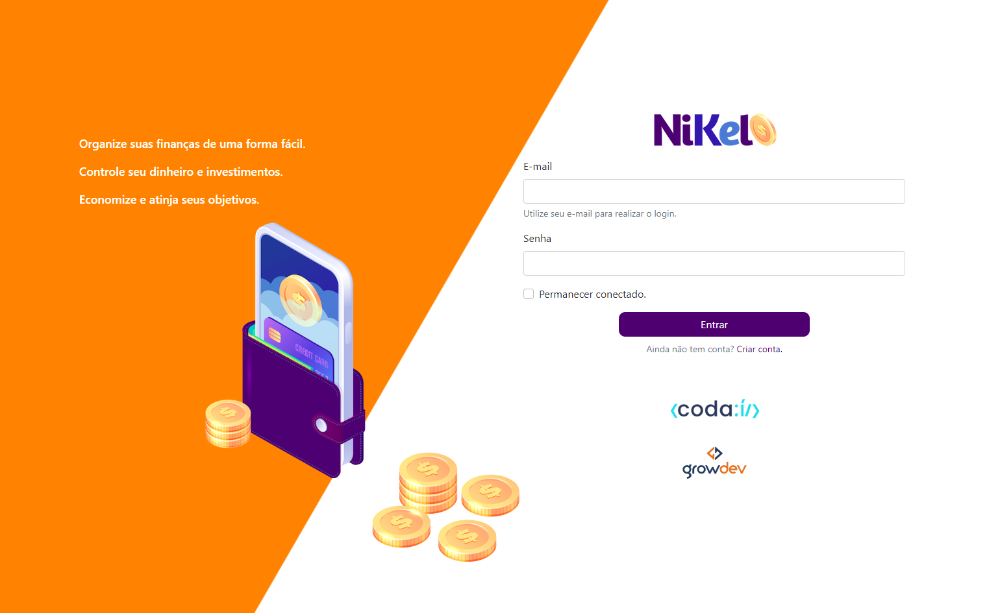
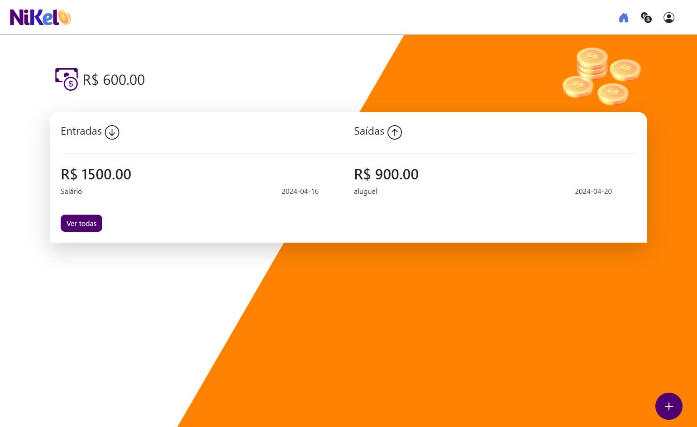
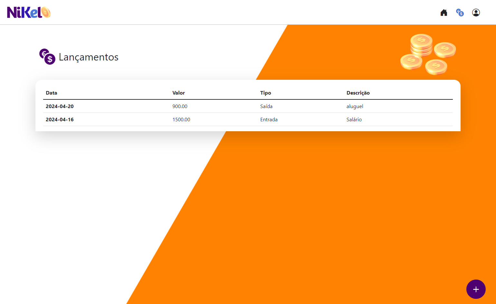
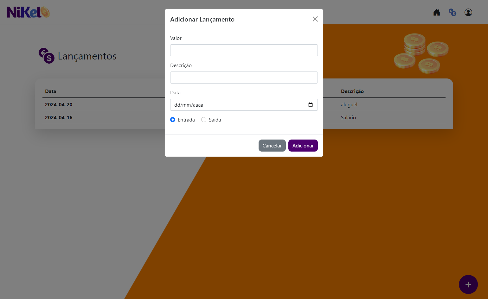

<h1 align="center">
     Projeto-Nikel
</h1>

---

## 🕵Sobre

Este é um repositório de exemplo para o projeto [Codaí] ( https://plataforma.growdev.com.br/curso/codai ).

---

## 🧑‍🦰Quem Faz

- WILSON RAMOS MAYER

---

## 🔠Conteúdos

<!--ts-->

- [Sobre](#sobre)
- [Quem Faz](#-quem-faz)
- [Status](#status)
- [Objetivo do Projeto](#objetivo-do-projeto)
- [Requisitos de Funcionalidade](#requisitos-de-funcionalidade)
- [Concepção do Projeto](#concepcao-do-projeto)
- [Rodando o Projeto](#rodando-o-projeto)
- [Sobre a Licença](#sobre-a-licença)
<!--te-->

---

## 🧭Status do Projeto

- ⌛ Feito

---

## 🎯Objetivo do Projeto

O projeto tem como objetivo a construção uma aplicação de gestão financeira com recursos criação de conta, login e inserção de receitas e despesas.

## ☑️Requisitos de Funcionalidade

- [x] Criação de novo usuário
- [x] Login com armazenamento de perfil na Local storage
- [x] Função de adicionar entradas e saídas financeiras

---

## 💡Concepção do Projeto.

Tela de login

Tela de home

Tela de transações

Tela para adicionar receitas ou despesas

---

## 🛰Rodando o Projeto

Para Rodar o projeto, siga as seguintes etapas :

- CLONAR O REPOSITÓRIO
- EXECUTAR NO NAVEGADOR O ARQUIVO INDEX.HTML

---

## 📝Sobre a Licença

Este projeto esta sobe a licença [MIT](./LICENSE).
